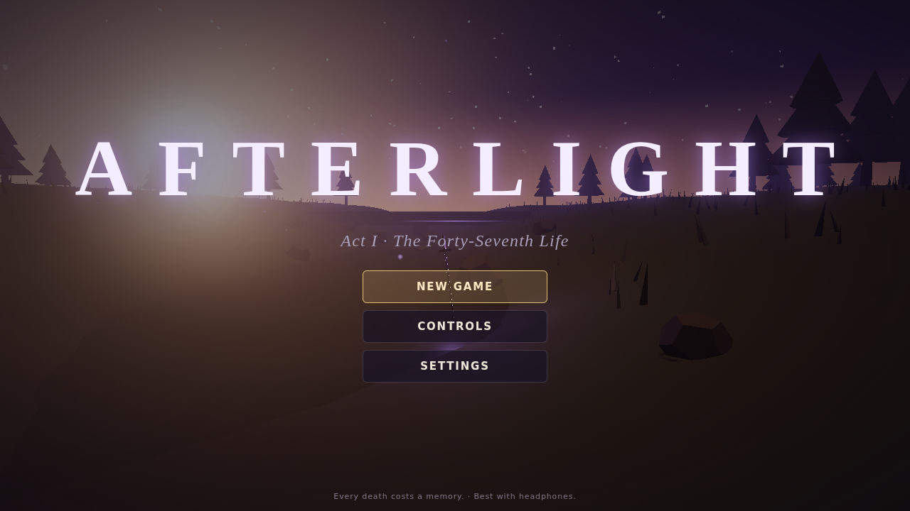
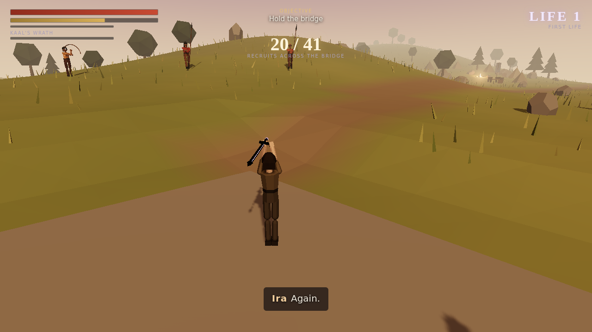
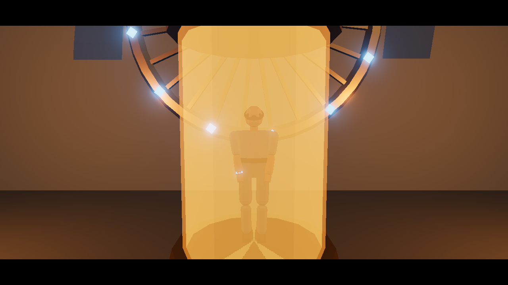
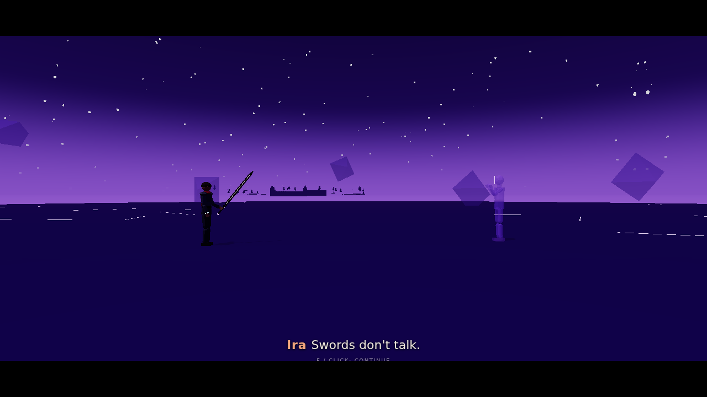
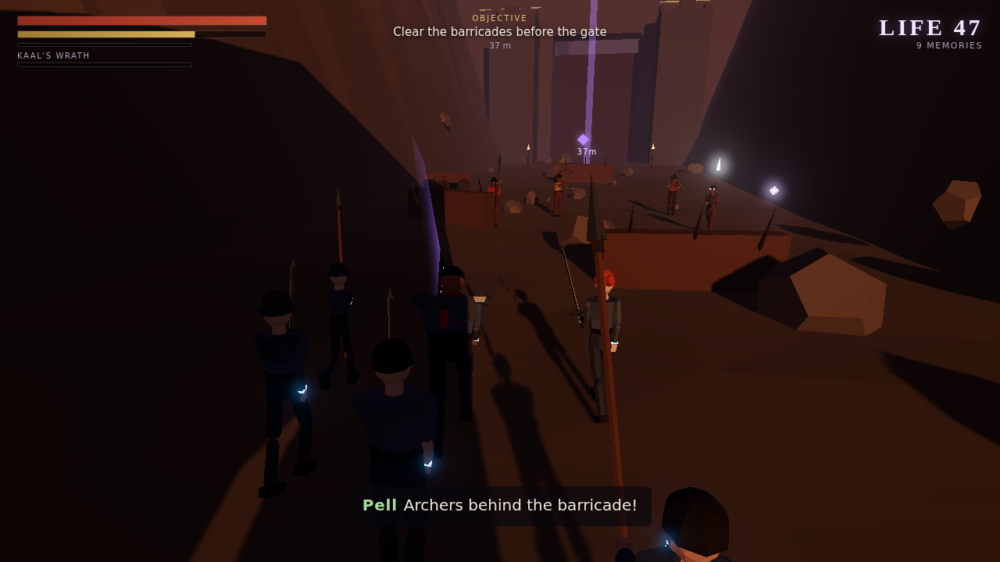
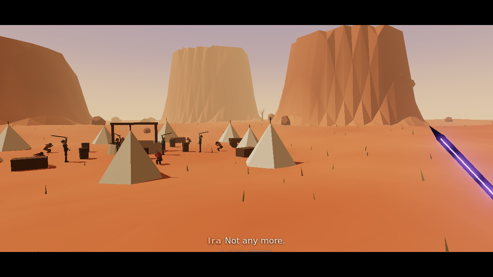
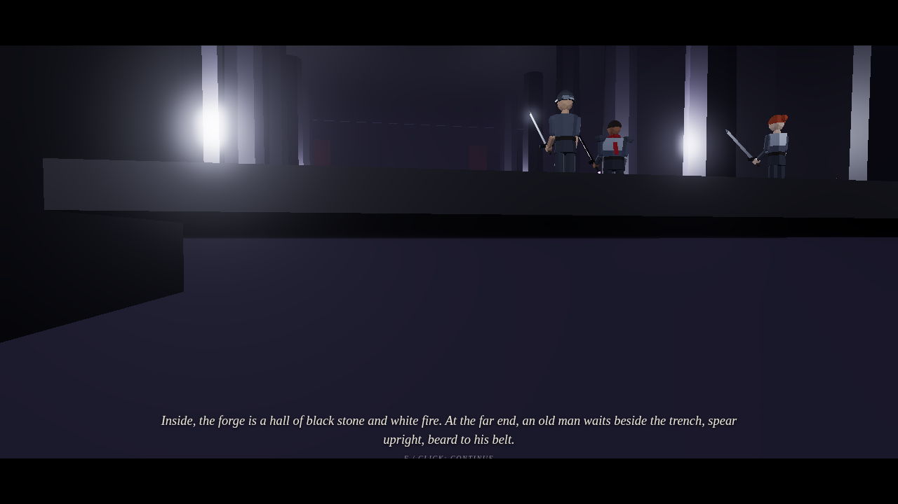

# AFTERLIGHT · Act I: The Forty-Seventh Life

> *Every death costs a memory.*

Afterlight is a stylised third-person action game that runs in your browser on **PC, Mac, with a gamepad, or on a phone or tablet**. You play Ira Solen in her forty-seventh life. Each time she dies, the Wheel brings her back in a new body, and one page of her memory book goes blank, taking its perk with it.

This repository is **Act I**: a prologue and four chapters, about **60–90 minutes** on a first playthrough.



| | |
|---|---|
|  |  |
|  |  |
|  |  |

## What's in Act I

| | Chapter | What happens |
|---|---|---|
| Prologue | **Kessel Ford** | Eighty-two years earlier. Forty-one recruits, one bridge one cart wide, and the first life of Ira Solen. The sword breaks; a black blade waits in the silt. |
| 1 | **Instance Forty-Seven** | A tank of amber fluid, a brother who never ages, and a sword that talks. Training inside the blade, then a spar with Marshal Corrow. |
| 2 | **The Litany Gate** | A siege behind a walking temple, a storm, a two-loop climb up the bell tower, and a duel with Sauvir, who has killed you twelve times. Then Pell. |
| 3 | **Sefir's Well** | Your own deserters burning a Reach village, a fight with their captain, and an old blind woman who knows your song. |
| 4 | **The Stillfire Forge** | Stillfire vents, Orsk the forge master, the glass plate that says *INSTANCE 47*, and a surrender in the snow. |

- **Around 30 combat encounters and 4 boss fights**: Corrow's spar, Sauvir, Varek Thorne and Orsk.
- **The memory system**: 11 memories, each with a perk. Death takes one at random, and memory shards hidden in each chapter bring them back.
- **Combat**: combo chains, heavy attacks, block, parry, invulnerable dodge rolls, posture breaks and executions, lock-on, and Kaal's Wrath. Unblockable stillfire strikes flash red.
- **The hum**: hold to heal slowly. Frightened deserters may lay down their arms if they hear it, and it matters in the story.
- **Story choices** that are remembered, and **3 difficulties**: Story, Soldier and Forty-Seven.
- **Everything is generated in code**, with no downloaded assets: procedural low-poly 3D models and animation, synthesised music that shifts between calm, tension, combat and boss moods, and synthesised sound effects. Dialogue is spoken with your device's built-in speech voices, and there are subtitles.
- **Saves automatically** at checkpoints in your browser. Continue and chapter select unlock as you play.

## Controls

The game shows these on a **How to Play** screen before you start, with your device detected automatically. You can open it again from the pause menu.

| Action | Keyboard & mouse (PC / Mac) | Gamepad | Phone / tablet |
|---|---|---|---|
| Move | `W A S D` | Left stick | Drag the left-side stick |
| Camera | Mouse (click the game to capture it) or arrow keys | Right stick | Drag on the right side |
| Light attack (tap again to combo) | Left click / `J` | X / ▢ | **Attack** |
| Heavy attack | `E` / `K` | Y / △ | **Heavy** |
| Block · tap just before a hit to **Parry** | Right click / `L` | LB / L1 | **Block** (hold) |
| Dodge roll | `Space` | A / ✕ | **Dodge** |
| Sprint | `Shift` (hold) | LT / L2 / L3 | Push the stick all the way |
| Hum (hold) | `H` | RB / R1 | **Hum** (hold) |
| Kaal's Wrath (violet bar full) | `Q` | RT / R2 | **Wrath** |
| Interact · Execute a staggered enemy | `F` | B / ◯ | **Use** |
| Lock on | `Tab` / middle click | R3 | **Lock** |
| Memory Book | `B` | View / Share | **Book** |
| Pause | `Esc` / `P` | Menu / Options | **II** |
| Skip a dialogue line in cutscenes | `F` / `Enter` / `Space` / click | A / ✕ | Tap **Use** or **Attack** |

**Mac trackpad:** click for a light attack and two-finger click to block. Many players prefer `J` `K` `L` for light, heavy and block, using the trackpad or arrow keys to look.
**Phones:** turn the phone sideways. Graphics default to Low on phones; you can raise them in Settings.

## Run it locally

You need [Node.js](https://nodejs.org) 20 or newer.

```bash
npm install
npm run dev        # open the printed http://localhost:5173 link
```

To build the static site:

```bash
npm run build      # outputs to dist/
npm run preview    # serves dist/ on http://localhost:4173
```

The `dist/` folder is plain static files, so you can upload it anywhere: GitHub Pages, itch.io (zip `dist/` as an HTML5 game), Netlify or Cloudflare Pages.

## Put it online for free (GitHub Pages)

This repo includes `.github/workflows/deploy.yml`, which builds and publishes the game every time `main` changes. It needs one setting to be turned on once:

1. On GitHub, open the repo and go to **Settings → Pages**.
2. Under **Build and deployment → Source**, choose **GitHub Actions**.
3. Merge to `main`, or run the **Deploy to GitHub Pages** workflow from the **Actions** tab.

The game will then be live at `https://<your-username>.github.io/afterlight/`.

## Project layout

```
src/
  main.ts              entry point
  Game.ts              game flow: title, chapters, pause, death and rebirth, saves, HUD
  core/                renderer and post-processing, input (keyboard/mouse/gamepad/touch),
                       camera, collision world, saves and settings
  audio/               Web Audio engine, procedural music, sound effects, speech voices
  entities/            procedural character rig and animation, weapons, player, enemy AI, roster
  combat/              attack definitions
  world/               terrain, water, structures, foliage, particles, weather
  levels/              Level framework (story scripting, dialogue, waves) and the five chapters
  story/               cast, voices and the memory book
  ui/                  menus, controls screen, HUD, subtitles, memory book, credits
```

Debug helpers for testing: open the game with `?debug` in the URL. Then, in the browser console, `__afterlight.startChapter(2, 'duel')` jumps to a checkpoint and `__afterlight.timeScale = 4` speeds the game up.

## Notes

- Built with [Three.js](https://threejs.org), TypeScript and Vite.
- Voices use the Web Speech API, so they sound different on every device and some browsers have fewer voices. You can turn spoken dialogue off in Settings and keep subtitles.
- The visual style is deliberately stylised low-poly rather than realistic.
- Story, world and characters by Krish, from the *Afterlight* design bible (16 volumes). Acts II to V, Godfall, The Other Side, Past Lives and the side stories are not in this build yet.
